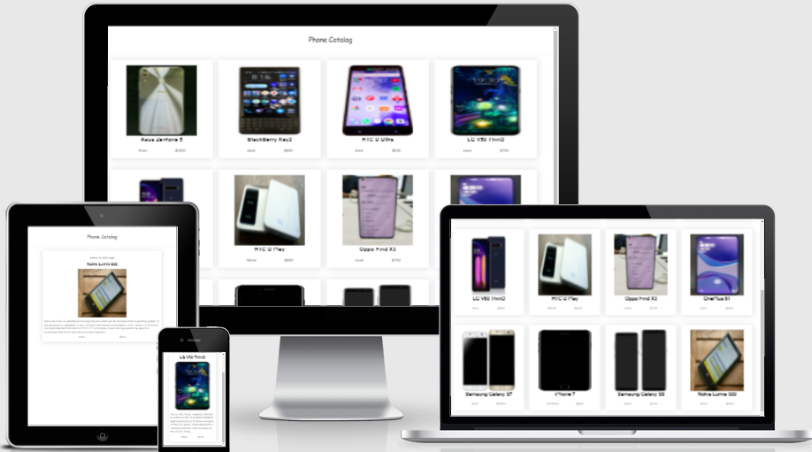

# PRODUCT CATALOG APP

> A simple product catalog app that returns a couple of mobile phones like iPhone 7, Samsung Galaxy S7 etc. with some simple attributes like product image, title, price, description and color.

 

## Technologies Used and Requirements

- React Redux
- Rails API for backend web service
- Stylelint for linting
- Prettier for formating
- [`Netlify`](https://www.netlify.com/) for API deployment

#### BACKEND REPO LINK

- [Backend Repo Link](https://github.com/bimbolabuari/product-catalog)

## Development (Running locally)

- Clone the project

```bash
git clone https://github.com/bimbolabuari/product-catalog-frontend.git
```

- Install Dependencies

```bash
$ npm start # Runs the app in the development mode.
```

- Or build
```bash
$ npm run build # Builds the app for production to the `build` folder.
```

## Netlify Deploy link

- [Netlify](https://product-catalog-frontend.netlify.app)


## 👤 Author

- Github: [@bimbolabuari](https://github.com/bimbolabuari)
- Twitter: [@bimbolabuari](https://twitter.com/bimbolabuari)
- Linkedin: [@bimbolabuari](https://www.linkedin.com/in/bimbolabuari/)

## Acknowledgement

- [wikimedia](https://upload.wikimedia.org)

## 📝 License

[MIT licensed](./LICENSE).